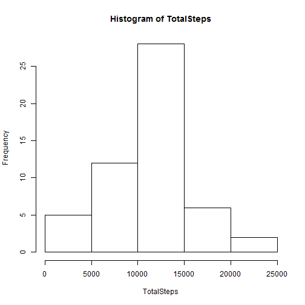
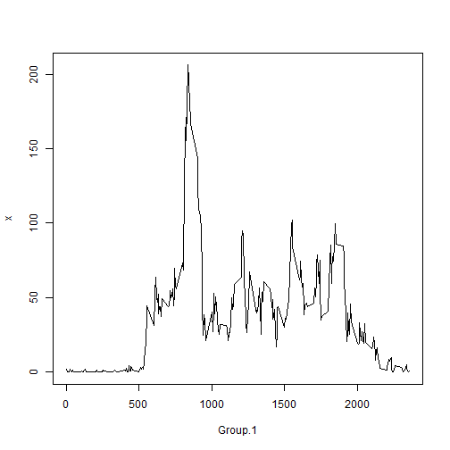
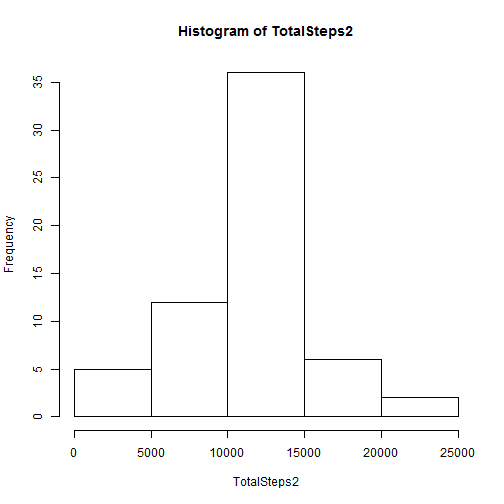
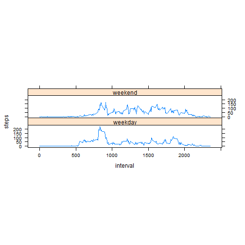

COURSERA Reproducible Research Project 1 Gregory Verleysen
========================================================

## Loading and preprocessing the data
### Load the data

```r
setwd("~/COURSERA/Reproducible research/Project1")

data<-read.csv("activity.csv")
data2<-na.omit(data)
```

## What is mean total number of steps taken per day?
### Calculate the total number of steps taken per day

```r
TotalSteps<-as.vector(by(data2$steps,data2$date,sum))
print(TotalSteps)
```

```
##  [1]    NA   126 11352 12116 13294 15420 11015    NA 12811  9900 10304
## [12] 17382 12426 15098 10139 15084 13452 10056 11829 10395  8821 13460
## [23]  8918  8355  2492  6778 10119 11458  5018  9819 15414    NA 10600
## [34] 10571    NA 10439  8334 12883  3219    NA    NA 12608 10765  7336
## [45]    NA    41  5441 14339 15110  8841  4472 12787 20427 21194 14478
## [56] 11834 11162 13646 10183  7047    NA
```

### Make a histogram of the total number of steps taken each day

```r
hist(TotalSteps)
```

 

### Calculate and report the mean and median of the total number of steps taken per day

```r
mean(TotalSteps,na.rm=TRUE)
```

```
## [1] 10766.19
```

```r
median(TotalSteps,na.rm=TRUE)
```

```
## [1] 10765
```

## What is the average daily activity pattern?
### Make a time series plot of the 5-minute interval and the average number of steps taken, averaged across all days

calculate mean

```r
adap<-aggregate(data2$steps,list(data2$interval),mean)
print(adap)
```

```
##     Group.1           x
## 1         0   1.7169811
## 2         5   0.3396226
## 3        10   0.1320755
## 4        15   0.1509434
## 5        20   0.0754717
## 6        25   2.0943396
## 7        30   0.5283019
## 8        35   0.8679245
## 9        40   0.0000000
## 10       45   1.4716981
## 11       50   0.3018868
## 12       55   0.1320755
## 13      100   0.3207547
## 14      105   0.6792453
## 15      110   0.1509434
## 16      115   0.3396226
## 17      120   0.0000000
## 18      125   1.1132075
## 19      130   1.8301887
## 20      135   0.1698113
## 21      140   0.1698113
## 22      145   0.3773585
## 23      150   0.2641509
## 24      155   0.0000000
## 25      200   0.0000000
## 26      205   0.0000000
## 27      210   1.1320755
## 28      215   0.0000000
## 29      220   0.0000000
## 30      225   0.1320755
## 31      230   0.0000000
## 32      235   0.2264151
## 33      240   0.0000000
## 34      245   0.0000000
## 35      250   1.5471698
## 36      255   0.9433962
## 37      300   0.0000000
## 38      305   0.0000000
## 39      310   0.0000000
## 40      315   0.0000000
## 41      320   0.2075472
## 42      325   0.6226415
## 43      330   1.6226415
## 44      335   0.5849057
## 45      340   0.4905660
## 46      345   0.0754717
## 47      350   0.0000000
## 48      355   0.0000000
## 49      400   1.1886792
## 50      405   0.9433962
## 51      410   2.5660377
## 52      415   0.0000000
## 53      420   0.3396226
## 54      425   0.3584906
## 55      430   4.1132075
## 56      435   0.6603774
## 57      440   3.4905660
## 58      445   0.8301887
## 59      450   3.1132075
## 60      455   1.1132075
## 61      500   0.0000000
## 62      505   1.5660377
## 63      510   3.0000000
## 64      515   2.2452830
## 65      520   3.3207547
## 66      525   2.9622642
## 67      530   2.0943396
## 68      535   6.0566038
## 69      540  16.0188679
## 70      545  18.3396226
## 71      550  39.4528302
## 72      555  44.4905660
## 73      600  31.4905660
## 74      605  49.2641509
## 75      610  53.7735849
## 76      615  63.4528302
## 77      620  49.9622642
## 78      625  47.0754717
## 79      630  52.1509434
## 80      635  39.3396226
## 81      640  44.0188679
## 82      645  44.1698113
## 83      650  37.3584906
## 84      655  49.0377358
## 85      700  43.8113208
## 86      705  44.3773585
## 87      710  50.5094340
## 88      715  54.5094340
## 89      720  49.9245283
## 90      725  50.9811321
## 91      730  55.6792453
## 92      735  44.3207547
## 93      740  52.2641509
## 94      745  69.5471698
## 95      750  57.8490566
## 96      755  56.1509434
## 97      800  73.3773585
## 98      805  68.2075472
## 99      810 129.4339623
## 100     815 157.5283019
## 101     820 171.1509434
## 102     825 155.3962264
## 103     830 177.3018868
## 104     835 206.1698113
## 105     840 195.9245283
## 106     845 179.5660377
## 107     850 183.3962264
## 108     855 167.0188679
## 109     900 143.4528302
## 110     905 124.0377358
## 111     910 109.1132075
## 112     915 108.1132075
## 113     920 103.7169811
## 114     925  95.9622642
## 115     930  66.2075472
## 116     935  45.2264151
## 117     940  24.7924528
## 118     945  38.7547170
## 119     950  34.9811321
## 120     955  21.0566038
## 121    1000  40.5660377
## 122    1005  26.9811321
## 123    1010  42.4150943
## 124    1015  52.6603774
## 125    1020  38.9245283
## 126    1025  50.7924528
## 127    1030  44.2830189
## 128    1035  37.4150943
## 129    1040  34.6981132
## 130    1045  28.3396226
## 131    1050  25.0943396
## 132    1055  31.9433962
## 133    1100  31.3584906
## 134    1105  29.6792453
## 135    1110  21.3207547
## 136    1115  25.5471698
## 137    1120  28.3773585
## 138    1125  26.4716981
## 139    1130  33.4339623
## 140    1135  49.9811321
## 141    1140  42.0377358
## 142    1145  44.6037736
## 143    1150  46.0377358
## 144    1155  59.1886792
## 145    1200  63.8679245
## 146    1205  87.6981132
## 147    1210  94.8490566
## 148    1215  92.7735849
## 149    1220  63.3962264
## 150    1225  50.1698113
## 151    1230  54.4716981
## 152    1235  32.4150943
## 153    1240  26.5283019
## 154    1245  37.7358491
## 155    1250  45.0566038
## 156    1255  67.2830189
## 157    1300  42.3396226
## 158    1305  39.8867925
## 159    1310  43.2641509
## 160    1315  40.9811321
## 161    1320  46.2452830
## 162    1325  56.4339623
## 163    1330  42.7547170
## 164    1335  25.1320755
## 165    1340  39.9622642
## 166    1345  53.5471698
## 167    1350  47.3207547
## 168    1355  60.8113208
## 169    1400  55.7547170
## 170    1405  51.9622642
## 171    1410  43.5849057
## 172    1415  48.6981132
## 173    1420  35.4716981
## 174    1425  37.5471698
## 175    1430  41.8490566
## 176    1435  27.5094340
## 177    1440  17.1132075
## 178    1445  26.0754717
## 179    1450  43.6226415
## 180    1455  43.7735849
## 181    1500  30.0188679
## 182    1505  36.0754717
## 183    1510  35.4905660
## 184    1515  38.8490566
## 185    1520  45.9622642
## 186    1525  47.7547170
## 187    1530  48.1320755
## 188    1535  65.3207547
## 189    1540  82.9056604
## 190    1545  98.6603774
## 191    1550 102.1132075
## 192    1555  83.9622642
## 193    1600  62.1320755
## 194    1605  64.1320755
## 195    1610  74.5471698
## 196    1615  63.1698113
## 197    1620  56.9056604
## 198    1625  59.7735849
## 199    1630  43.8679245
## 200    1635  38.5660377
## 201    1640  44.6603774
## 202    1645  45.4528302
## 203    1650  46.2075472
## 204    1655  43.6792453
## 205    1700  46.6226415
## 206    1705  56.3018868
## 207    1710  50.7169811
## 208    1715  61.2264151
## 209    1720  72.7169811
## 210    1725  78.9433962
## 211    1730  68.9433962
## 212    1735  59.6603774
## 213    1740  75.0943396
## 214    1745  56.5094340
## 215    1750  34.7735849
## 216    1755  37.4528302
## 217    1800  40.6792453
## 218    1805  58.0188679
## 219    1810  74.6981132
## 220    1815  85.3207547
## 221    1820  59.2641509
## 222    1825  67.7735849
## 223    1830  77.6981132
## 224    1835  74.2452830
## 225    1840  85.3396226
## 226    1845  99.4528302
## 227    1850  86.5849057
## 228    1855  85.6037736
## 229    1900  84.8679245
## 230    1905  77.8301887
## 231    1910  58.0377358
## 232    1915  53.3584906
## 233    1920  36.3207547
## 234    1925  20.7169811
## 235    1930  27.3962264
## 236    1935  40.0188679
## 237    1940  30.2075472
## 238    1945  25.5471698
## 239    1950  45.6603774
## 240    1955  33.5283019
## 241    2000  19.6226415
## 242    2005  19.0188679
## 243    2010  19.3396226
## 244    2015  33.3396226
## 245    2020  26.8113208
## 246    2025  21.1698113
## 247    2030  27.3018868
## 248    2035  21.3396226
## 249    2040  19.5471698
## 250    2045  21.3207547
## 251    2050  32.3018868
## 252    2055  20.1509434
## 253    2100  15.9433962
## 254    2105  17.2264151
## 255    2110  23.4528302
## 256    2115  19.2452830
## 257    2120  12.4528302
## 258    2125   8.0188679
## 259    2130  14.6603774
## 260    2135  16.3018868
## 261    2140   8.6792453
## 262    2145   7.7924528
## 263    2150   8.1320755
## 264    2155   2.6226415
## 265    2200   1.4528302
## 266    2205   3.6792453
## 267    2210   4.8113208
## 268    2215   8.5094340
## 269    2220   7.0754717
## 270    2225   8.6981132
## 271    2230   9.7547170
## 272    2235   2.2075472
## 273    2240   0.3207547
## 274    2245   0.1132075
## 275    2250   1.6037736
## 276    2255   4.6037736
## 277    2300   3.3018868
## 278    2305   2.8490566
## 279    2310   0.0000000
## 280    2315   0.8301887
## 281    2320   0.9622642
## 282    2325   1.5849057
## 283    2330   2.6037736
## 284    2335   4.6981132
## 285    2340   3.3018868
## 286    2345   0.6415094
## 287    2350   0.2264151
## 288    2355   1.0754717
```

plot mean

```r
plot(adap,type="l")
```

 

### Which 5-minute interval, on average across all the days in the dataset, contains the maximum number of steps?

```r
adap[which.max(adap$x),1]
```

```
## [1] 835
```

## Imputing missing values
### Calculate and report the total number of missing values in the dataset (i.e. the total number of rows with NAs)

```r
length(which(is.na(data)))
```

```
## [1] 2304
```

### Devise a strategy for filling in all of the missing values in the dataset. The strategy does not need to be sophisticated. For example, you could use the mean/median for that day, or the mean for that 5-minute interval, etc.

```r
means<-rep(adap$x,length(unique(data$date)))
```

### Create a new dataset that is equal to the original dataset but with the missing data filled in.

```r
data3<-data

for(i in 1:length(data3$steps)){
  if(is.na(data3$steps[i])) data3$steps[i] <- means[i]
}
```

### Make a histogram of the total number of steps taken each day and Calculate and report the mean and median total number of steps taken per day. Do these values differ from the estimates from the first part of the assignment? What is the impact of imputing missing data on the estimates of the total daily number of steps?

```r
TotalSteps2<-as.vector(by(data3$steps,data3$date,sum))
hist(TotalSteps2)
```

 
## Do these values differ from the estimates from the first part of the assignment? What is the impact of imputing missing data on the estimates of the total daily number of steps?
In the imputed version the missing values have been replcaed by interval means. So there is a noticeable difference.

mean and median

```r
mean(TotalSteps2)
```

```
## [1] 10766.19
```

```r
median(TotalSteps2)
```

```
## [1] 10766.19
```

## Are there differences in activity patterns between weekdays and weekends?
### Create a new factor variable in the dataset with two levels - "weekday" and "weekend" indicating whether a given date is a weekday or weekend day.

```r
thedate<-as.Date(data3$date)
data3$day <- weekdays(as.Date(data3$date))
data3$daytype<-ifelse(data3$day %in% c("maandag","dinsdag","woensdag","donderdag","vrijdag"),"weekday","weekend")
```

### Make a panel plot containing a time series plot of the 5-minute interval and the average number of steps taken, averaged across all weekday days or weekend days. 

```r
library(lattice)
```

```
## Warning: package 'lattice' was built under R version 3.0.3
```

```r
meanstep <- aggregate(steps ~ interval + daytype, data=data3, mean)
xyplot(steps  ~ interval|daytype, superpose=TRUE, aspect="xy", data = meanstep,type="l")
```

 


